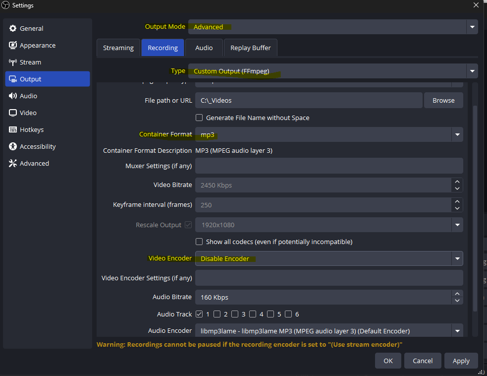
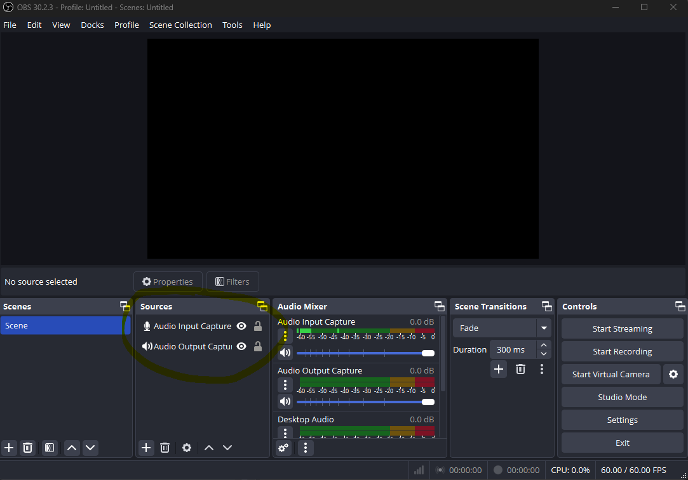

# Fully Open Source Note and Minute Taking for Online or On-Site Meetings

**No more crying for having to take the minutes!**


## Overview

This project is your ultimate meeting minute generator for effortlessly taking notes and minutes during online or on-site meetings. No API keys required—just use your own chat AI! Whether you're a Windows or Linux, this tool has got you covered.

## Usage

1. **Run the Script:**
   - On **Windows**: Execute `totomate.bat`.
   - On **Linux**: Execute `totomate.sh` (Untested, but let's be optimistic!).

2. **End the Meeting:**
   - Press `Enter` when the meeting concludes.

3. **Transcribe and Contextualize:**
   - Once transcribed, select the context of the meeting or enter a custom one
   - Paste (`Ctrl+V`) the content of the clipboard into ChatGPT, [Open WebUI](https://github.com/open-webui/open-webui), or your favorite chat AI (ChatGPT 4o or better recommended).

## Settings

### Model for Transcribing `model_size`
- **Examples:** `tiny.en`, `medium`, `distil-large-v2`, `faster-distil-medium.en`, `large-v3`,... check distil- and Whisper model for a full list.

### Context for Different Meetings `meeting_context`
- Customize the context to fit various meeting types. Append or edit.
- **Example:**
    ```python
    (
    "Project Kickoff Meeting",
    """Write the minutes for the transcript. The speakers are not written down. The transcript was automatic, account for potential mistakes in your minutes. The context is a project kickoff meeting for a new software development project. Follow the meeting as per those points:
    **Title:** Weekly Meeting
    **Date and Time:** [Leave Blank if Unknown]
    **Attendees:** [Leave Blank if Unknown]
    - Project Overview
    - Team Roles and Responsibilities
    - Key Milestones
    - Risks and Mitigation Strategies
    - Next Steps"""
    ),
    ```

## Principle

1. **OBS Records All Sounds:**
   - OBS captures audio from both the microphone and the computer.
   - The recording is transcribed using Faster-Whisper.
   - Both the audio and transcriptions are stored in OBS's default folder—typically your default Video folder.

2. **Contextual Transcription:**
   - A context is added to the transcript to structure the minutes as expected.
   - The full prompt is copied to the clipboard for easy pasting into your AI tool.

## Setup

### Clone the Repository
- Clone the repository (unexpected, right?).

### Open a Terminal
- Navigate to the cloned repository.

### (Optional) Create a Virtual Environment
- Run `python -m venv .venv` to create a virtual environment.
- **Activate the Virtual Environment:**
  - On **Windows**: Run `.\.venv\Scripts\activate`.
  - On **Linux/Mac**: Run `source .venv/bin/activate`.

### Install Faster-Whisper

- **Without CUDA:**
  - Simply run `pip install faster-whisper`.

- **With CUDA (NVidia Acceleration - Recommended if Possible):**
  - **Step 1: Install cuDNN**
    - Visit [NVIDIA cuDNN Archive](https://developer.nvidia.com/rdp/cudnn-archive) and download cuDNN v8.9.7.
    - Extract the contents of the `/bin` folder to your cloned repository.

  - **Step 2: Install CUDA**
    - Download the latest 12.x version of CUDA from [NVIDIA CUDA Downloads](https://developer.nvidia.com/cuda-downloads).

  - **Step 3: Reboot or Refresh PATH**
    - Reboot your system (or refresh your PATH environment variables).

  - **Additional Notes**
    - For updated instructions, refer to the [Faster-Whisper GitHub](https://github.com/SYSTRAN/faster-whisper).

### Python Compatibility
- Should be compatible with Python 3.8+.
- (Create a virtual environment if you prefer.)

### Configure OBS
1. **Launch OBS:**
   - On the bottom right, click `Settings`.

2. **Change the Following Parameters:**
   - **Save OBS Recording as mp3** (Optional, but recommended—your computer will thank you).
   - In the `Output` tab:
     - Select `Output Mode`: `Advanced`.
     - Go to `Recording`.
     - Select `Type`: `Custom Output (Ffmpeg)`.
     - `Container format`: `mp3`.
     - `Video Encoder`: `Disable Encoder`.



3. **Add Audio Sources:**
   - In `Sources`, press `+` and add:
     - `Audio Input Capture` - Leave on Default.
     - `Audio Output Capture` - Same.



### Install Dependencies
- Run `pip install -r requirements.txt`.

### (Optional) Create a shortcut
    - (Windows) Right-click on the script "Send To" -> "Desktop (create shortcut)"

**Done!** You're all set to take notes like a pro.

---

**Note:** This documentation is fully open source, just like the code. Feel free to contribute, improve, or even add more jokes!

**Maintained by @chgayot at StepUp Solutions**